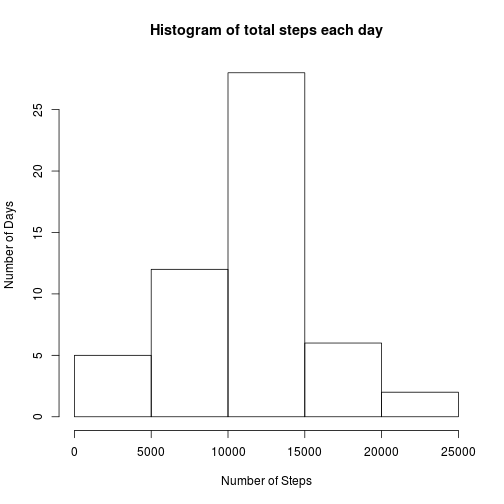
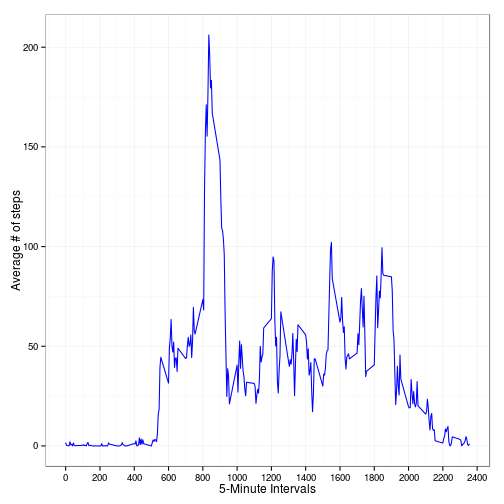
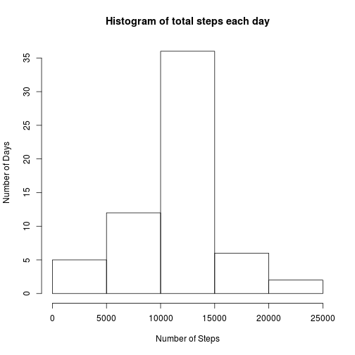
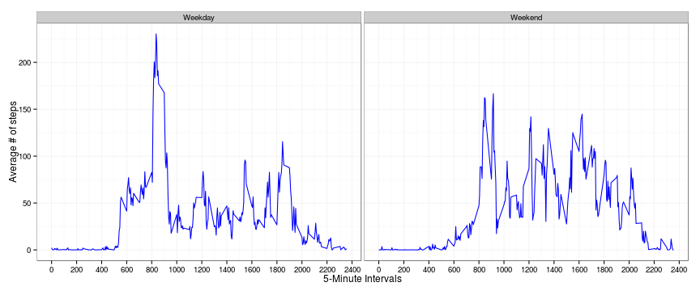

## Loading and preprocessing the data


```r
#read in data
vals <- read.csv(file="activity.csv", header=TRUE, sep=",")
#format date column
library(lattice)
vals$date <- as.Date(vals$date, "%Y-%m-%d")

#make copy for question 4 & 5 later...
vals_orig <- vals 

#remove NAs
vals <- vals[complete.cases(vals),]
```

## What is mean total number of steps taken per day?


```r
#aggregate data for histogram
hist_data <- aggregate(steps~date, data=vals, sum)
hist(hist_data$steps, xlab="Number of Steps", ylab="Number of Days", main="Histogram of total steps each day")
```

 

Mean total number of steps, rounded to nearest whole number, is

```r
round(mean(hist_data$steps))
```

```
## [1] 10766
```

Median total number of steps, rounded to nearest whole number, is

```r
round(median(hist_data$steps))
```

```
## [1] 10765
```

## What is the average daily activity pattern?


```r
interval_activity <- tapply(vals$steps, vals$interval, mean)
interval_activity <- data.frame(interval=as.numeric(names(interval_activity)), avg_steps=interval_activity)
library(ggplot2)
ggplot(interval_activity, aes(x=interval,y=avg_steps)) +
  geom_line(color="blue") + 
  scale_x_continuous("5-Minute Intervals", breaks=seq(0,2400,by=200)) +
  scale_y_continuous("Average # of steps") + 
  theme_bw()
```

 

The 5-minute interval that contains the largest number of steps is

```r
interval_activity$interval[which.max(interval_activity$avg_steps)]
```

```
## [1] 835
```

## Inputing missing values
Total number of rows with missing values is

```r
nrow(vals_orig) - nrow(vals)
```

```
## [1] 2304
```

```r
for (i in 1:nrow(vals_orig)) {
  if (is.na(vals_orig$steps[i])) {
    interval_num <- vals_orig$interval[i]
    vals_orig$steps[i] <- interval_activity$avg_steps[interval_activity$interval == interval_num]
  }
}
#aggregate data for histogram
hist_data_new <- aggregate(steps~date, data=vals_orig, sum)
hist(hist_data_new$steps, xlab="Number of Steps", ylab="Number of Days", main="Histogram of total steps each day")
```

 

New mean total number of steps, rounded to nearest whole number, is

```r
round(mean(hist_data_new$steps))
```

```
## [1] 10766
```

New median total number of steps, rounded to nearest whole number, is

```r
round(median(hist_data_new$steps))
```

```
## [1] 10766
```

The mean remains unchanged, while the median changes. Since we have replaced the NAs with the interval mean, the mean remaining unchanged is expected. The median changes because the number of observables has increased, which can potentially shift the median value that is selected, which has happened in this case.

## Are there differences in activity patterns between weekdays and weekends?


```r
#using the dataset from part 4, where missing values were replaced with mean..
vals_orig$day <- weekdays(vals_orig$date)

vals_orig$day[vals_orig$day == "Saturday" | vals_orig$day == "Sunday"] <- "Weekend"
vals_orig$day[vals_orig$day != "Weekend"] <- "Weekday"

vals_orig$day <- factor(vals_orig$day)
vals_orig <- aggregate(steps~interval+day, data=vals_orig, mean)

ggplot(vals_orig, aes(x=interval,y=steps)) +
  geom_line(color="blue") +
  facet_grid(~day) +
  scale_x_continuous("5-Minute Intervals", breaks=seq(0,2400,by=200)) +
  scale_y_continuous("Average # of steps") + 
  theme_bw()
```

 

From the plot, we can see that the individual had a differing walking pattern on weekdays and weekends. Visually, it appears that the individual walked more on weekdays on average.
